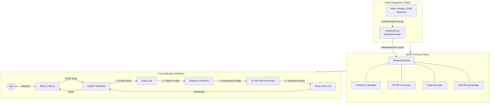

# AI Career Advisor

AI-powered career prediction, skill recommendation, and personalized guidance system. Uses XGBoost classification, TF-IDF similarity matching, and Groq Llama 3.3 70B to deliver action-oriented career advice in a modern, interactive chat interface.

**[Live Demo →](https://career-intelligence.onrender.com/)**

---

## Features

- **Career Profile Prediction** — XGBoost classifier predicts your ideal career path from your skills
- **Smart Skill Recommendations** — Profile-aware filtering finds the most high-impact skills for your career
- **AI Career Chat** — Groq Llama 3.3 powers a conversational advisor that understands your context
- **Modern React UI** — Beautiful, responsive chat interface with 3D avatar and "Matrix" aesthetics
- **Robust Backend** — FastAPI server handling predictions, recommendations, and chat logic
- **Cloud-Ready** — Render deployment blueprint included

### Supported Career Tracks

ML Engineer · Data Scientist · Data Analyst · Business Analyst · BI Developer · Backend · Frontend · Full Stack · Mobile · Blockchain/Web3 · Security Analyst · MLOps

---

## Quick Start

### Prerequisites

- Python 3.10+
- Node.js 16+
- Free Groq API key from [console.groq.com](https://console.groq.com)

### Install & Run

```bash
# Clone
git clone https://github.com/AbhiGupta1310/AI-Career-Advisor.git
cd AI-Career-Advisor

# Backend Setup
make install       # Install Python dependencies
cp .env.example .env
# Edit .env and add your GROQ_API_KEY

# Frontend Setup
cd frontend
npm install        # Install React dependencies
cd ..

# Run Development Server
make dev           # Starts both Backend (port 8000) and Frontend (port 5173)
```

### Deploy to Render (Free)

1. Push this repo to GitHub
2. Go to [render.com](https://render.com) → New → Blueprint
3. Connect your repo (it auto-detects `render.yaml`)
4. Add `GROQ_API_KEY` as an environment variable
5. Deploy!

---

## 📁 Project Structure

```
AI-Career-Advisor/
├── app/
│   ├── api/                    # FastAPI backend routes
│   │   ├── main.py             # App entry point
│   │   └── routes/             # predict, recommend, and chat endpoints
│   ├── core/                   # Business logic
│   │   ├── config.py           # Settings (env-driven)
│   │   ├── model.py            # ML prediction & recommendation logic
│   │   └── advisor.py          # Groq LLM integration
│   └── frontend/               # (Legacy Streamlit code, pending removal)
├── frontend/                   # Modern React Application
│   ├── src/
│   │   ├── App.jsx             # Main chat interface & logic
│   │   ├── Avatar3D.jsx        # 3D Robot character component
│   │   └── index.css           # Neo-brutal/Cyberpunk styling
│   └── public/                 # Static assets (3D models, icons)
├── data/
│   ├── models/                 # Trained ML artifacts
│   └── processed/combined.csv  # Profile dataset
├── scripts/                    # Data processing pipelines
├── tests/                      # Pytest suite
├── render.yaml                 # Deployment config
├── Makefile                    # Command shortcuts
└── requirements.txt            # Python dependencies
```

---

## 🛠️ Tech Stack

| Layer          | Technology                 |
| -------------- | -------------------------- |
| **API**        | FastAPI + Uvicorn          |
| **Frontend**   | React + Vite + Three.js    |
| **ML Models**  | XGBoost, scikit-learn      |
| **AI Advisor** | Groq Llama 3.3 70B (free)  |
| **Config**     | pydantic-settings + `.env` |
| **CI/CD**      | GitHub Actions             |
| **Deploy**     | Render                     |

---

## ⚙️ How It Works — End-to-End Workflow



### Chat Pipeline (Step-by-Step)

1. **User sends a message** → React frontend `POST`s to `/chat`
2. **NLP Extraction** → Groq LLM parses skills, experience, education, certifications from natural language
3. **Career Prediction** → XGBoost pipeline predicts one of 12 career profiles (ML Engineer, Data Scientist, Frontend Dev, etc.)
4. **Skill Recommendation** → TF-IDF similarity finds profiles like yours, filters recommendations by predicted career track
5. **AI Response** → Groq Llama 3.3 70B combines ML insights with conversational career advice
6. **Typewriter render** → React renders the response with streaming effect + markdown formatting

### Development Workflow

```bash
make install     # Install Python + Node.js dependencies
make dev         # Start backend (port 8000) + frontend (port 5173) concurrently
make test        # Run pytest suite
make lint        # Ruff linting on app/, scripts/, tests/
make format      # Auto-format code with Ruff
make build       # Production build (React → frontend/dist/)
make clean       # Remove __pycache__, .pyc, .DS_Store, dist/
```

### Data Pipeline

```bash
# Preprocess raw LinkedIn JSON profiles into structured CSV
python -m scripts.preprocess --json-dir data/raw --output-dir data/processed
```

---

**Built with ❤️ by Abhi Gupta**
